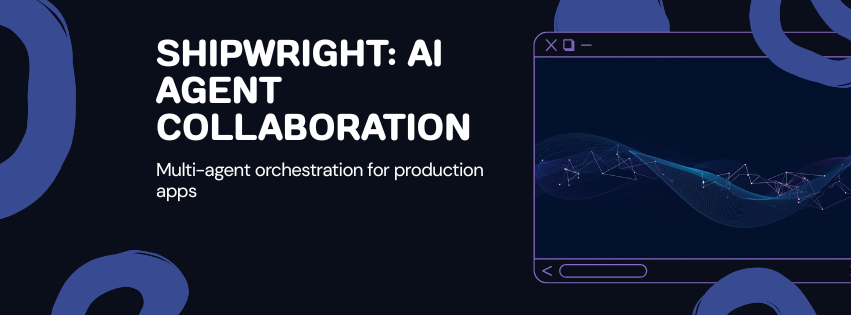

<p align="center">
  
</p>

<p align="center">
  <strong>Multi-agent orchestration for building production apps with Claude Code</strong>
</p>

<p align="center">
  <a href="https://github.com/aster2709/shipwright/stargazers"></a>
  <a href="https://github.com/aster2709/shipwright/blob/main/LICENSE"></a>
  <a href="https://github.com/aster2709/shipwright"></a>
  <a href="https://x.com/0x_aster"></a>
</p>

---

You describe what you want to build. Shipwright orchestrates 15 specialized AI agents through a 12-phase pipeline, from requirements to deployed and QA-tested.

## Prerequisites

- [Claude Code](https://claude.ai/claude-code) with Claude Max plan
- [acpx](https://github.com/openclaw/acpx) - deterministic graph execution engine

```bash
npm install -g acpx@latest
```

## Quick Start

```bash
gh repo create my-app --template aster2709/shipwright --clone --private
cd my-app
```

### Option A: acpx (recommended — deterministic)

The graph engine drives every phase. No skipping, no idle agents, automatic retries.

```bash
# Edit your requirement
nano .acpx-flows/build-input.json

# Run the pipeline
acpx flow run .acpx-flows/build.flow.ts --input-file .acpx-flows/build-input.json
```

### Option B: Claude Code Skills (flexible, human-in-the-loop)

```bash
claude --dangerously-skip-permissions
# Then: /build a SaaS invoice platform with Stripe integration
```

## How It Works

```
Requirements → Research → Architecture → Design → Skeleton
  (gate)                    (gate)
                                                      ↓
Implementation Planning → Backend + Frontend (parallel)
      (gate)                        ↓
                              Testing → Review → Audit → Deploy → QA
```

LLMs used as orchestrators idle between phases, skip steps, and forget to check on teammates. Shipwright pairs a **deterministic graph engine** ([acpx](https://github.com/openclaw/acpx)) with **Claude Code** as the agent runtime. The graph handles scheduling, retries, and branching. The LLM handles reasoning and coding.

## Agents (15)

| Agent | Role |
|---|---|
| team-lead | Orchestrates pipeline, enforces completion, never idles |
| requirements-analyst | Clarifying questions, PRD with budget/deployment constraints |
| researcher | Best practices, cost analysis, technology recommendations |
| architect | System design, API contracts, data model, cost estimates |
| ui-designer | Design system, shadcn/ui + Magic UI scaffolding via 21st.dev |
| skeleton-builder | Repo structure, configs, empty modules that compile |
| implementation-planner | Task breakdown with dependencies and file ownership |
| backend-implementer | API routes, database, integrations, business logic |
| frontend-implementer | Pages, components, styling per DESIGN.md spec |
| test-engineer | Unit, integration, component tests |
| reviewer | Security, performance, correctness review |
| auditor | PRD coverage verification, gap analysis |
| deployer | Platform deployment, env config, cost-aware |
| monitor | Post-deploy health checks, CI/CD verification |
| qa-tester | Deep code audit, traces flows end-to-end, finds what breaks |

## Execution Modes

| Mode | Engine | Completion | Best for |
|---|---|---|---|
| acpx flow | Graph engine (deterministic) | Guaranteed — all nodes must complete | Production builds, reliability |
| /build skill | LLM orchestrator (Agent Teams) | Best-effort — LLM may idle or skip | Exploratory work, flexibility |
| /feature skill | LLM orchestrator (Agent Teams) | Best-effort | Quick feature additions |

## Skills

| Skill | When |
|---|---|
| `/build` | New app from scratch — full 12-phase pipeline |
| `/feature` | Add features to an existing codebase — 8 phases |
| `/audit` | Gap check against PRD anytime |

## Agent Communication

1. **Direct messaging** — teammates talk to each other for questions and handoffs
2. **Shared task list** — work items with dependencies and status tracking
3. **docs/ folder** — formal outputs that become the project's source of truth

The team lead is the heartbeat — actively checks progress, spawns next phases immediately, never waits passively.

## Documentation

Agents produce these artifacts in `docs/`:

| File | Producer | Contents |
|---|---|---|
| PRD.md | requirements-analyst | Product requirements, user stories, constraints |
| RESEARCH.md | researcher | Technology recommendations with cost analysis |
| ARCHITECTURE.md | architect | System design, API contracts, deployment plan |
| DESIGN.md | ui-designer | Visual design system, component library choices |
| IMPLEMENTATION_PLAN.md | implementation-planner | Tasks with dependencies and file ownership |
| QA-REPORT.md | qa-tester | Browser test results with screenshots |

## Architecture

```
cmux / tmux                          (observe agents in split panes)
  └── acpx                           (deterministic graph engine — schedules phases)
       └── Claude Code               (agent runtime — executes each node)
            ├── 15 agent definitions  (each owns one phase)
            ├── docs/                 (inter-agent communication via artifacts)
            └── Honcho               (persistent memory across projects)
```

## Self-Improvement

After successful builds, reusable patterns are saved to `.claude/skills/learnings/`. Future builds reference these to avoid rediscovering the same solutions. The more you build, the better it gets.

### Recommended

- [cmux](https://cmux.com) or tmux - split-pane agent visibility
- [Honcho](https://honcho.dev) plugin - persistent memory across projects
- 21st.dev Magic components - UI design inspiration

## License

MIT
